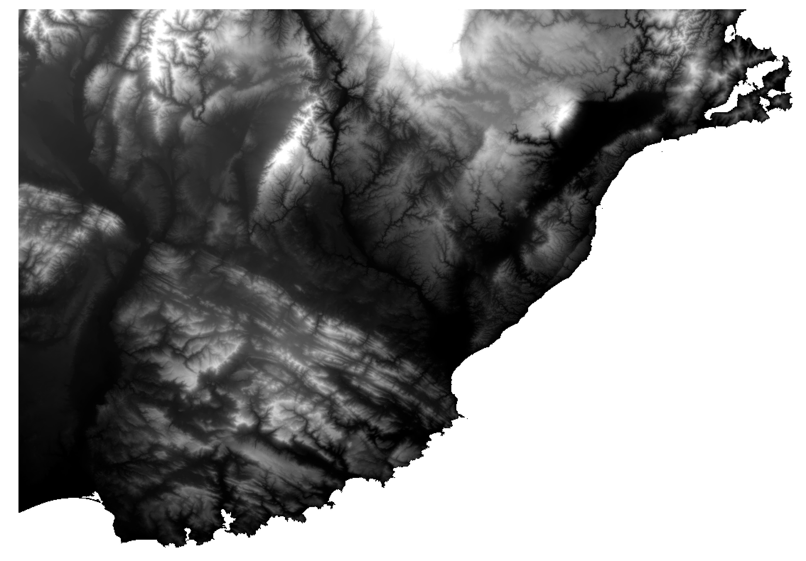

# 3D Printable model of the Otago Peninsula and Dunedin, NZ

This repo contains the raw GeoTIFF and finsished printable STL for a 3D printable model (the zip file) of Dunedin and the Otago Peninsula in New Zealand.

The process can be applied to any ROI and generally consists of:

1. Acquire DEM
2. Clip to region of interest
3. Convert to STL mesh
4. Clean mesh (this is the fidliest part and hardest to "script") and add a base in Meshmixer
5. Slice and print in your slicer of choice

## Acquire Raster DEM

Raster DEM acquired from [LRIS](https://lris.scinfo.org.nz)

Product downloaded was: `lris-nzdem-south-island-25-metre-GTiff`



## Clip to ROI in QGIS

Using QGIS, I clipped down to the region of interest


## Convert to STL mesh

Used [phstl.py](https://github.com/anoved/phstl) to convert the GTiff to STL.

```
./phstl.py -x 300  -z 3 otago_penninsula.tif otago_penninsula_raw.stl

```

## Meshmixer

Using meshmixer I filled holes in the mesh and extruded along the STL's Y-axis to a plane about 10mm below the highest peak. This depth gave the inlets that hold together the peninsula some materal to "grab onto" so the final product was printable as one connected piece.

Final STL from Meshmixer is what is included here in this repo.

## Printed

Using Simplify 3D Slicer I printed the model on my CR-10. I used 0.4mm layer hight for the bottom/base 3mm, then switched to 0.1mm layer height for the terrain layers.


